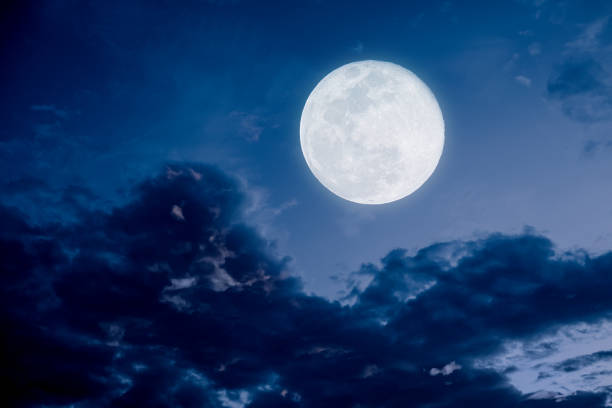

# Lune

La Lune est l'unique satellite de la Terre

## Caractéristiques 

- Masse : 7.3477 x 1022 kg
- Rayon équatorial : 1737.4 km
- Rayon polaire : 1735.97 km
- Période de révolution : 27.321582 jours / 27j 7h 43min 6s
- Symbole : &#x1F311;
