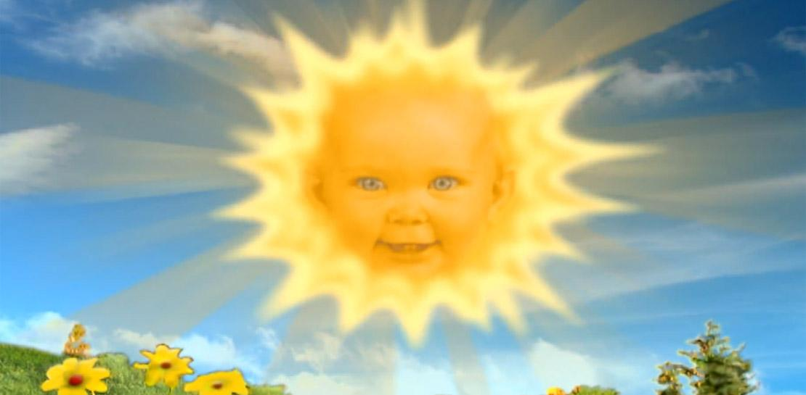

# Soleil 

Le soleil est l'étoile au centre du système solaire 

## Caractéristiques 

- Masse : 1.989 x 1030 kg
- Diamètre : 1 392 684 km
- Distance au centre de la Voie Lactée : 2.52 x 1017 km
- Symbole : &#9728;
