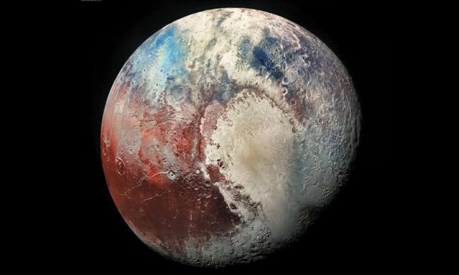

# Pluton 

Pluton est une planète naine, la plus volumineuse connue dans le système solaire.

## Caractéristiques

- Masse : 1.314 x 1022 kg
- Rayon Equatorial : 1 185 km
- Volume : 6.97 x 109 km3
- Symbole : &#9799;
